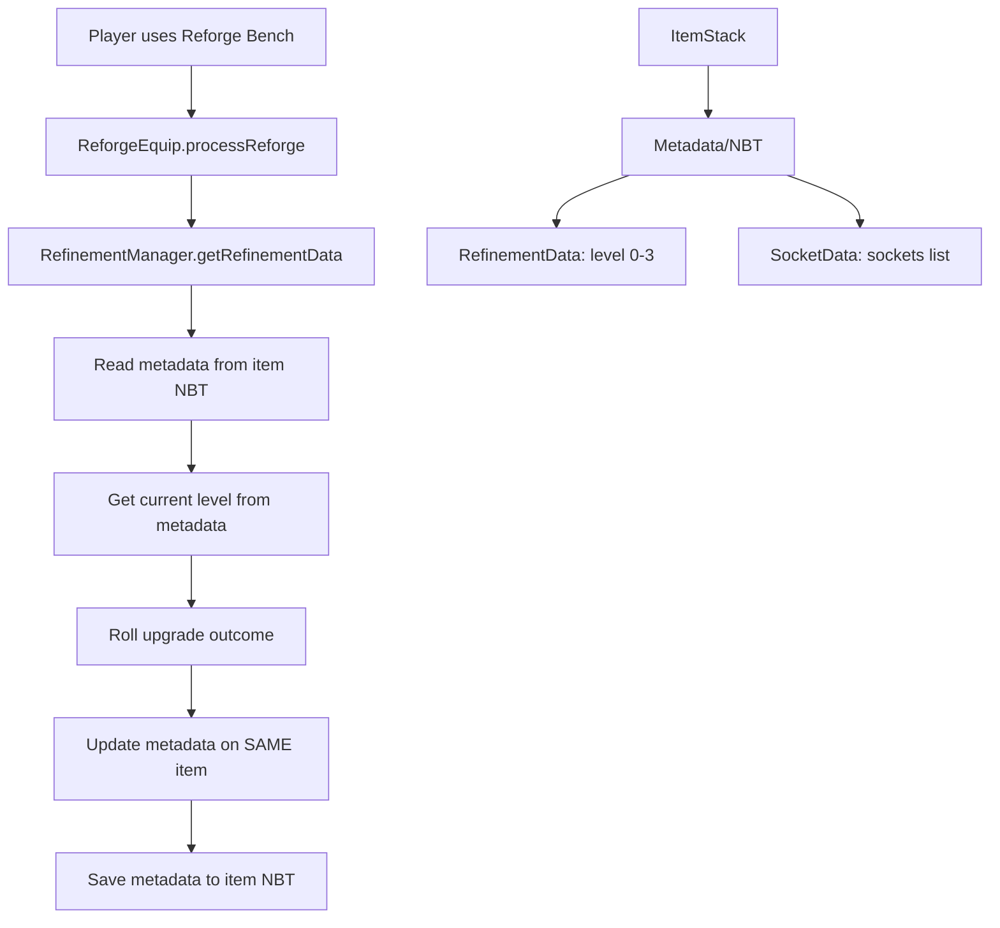
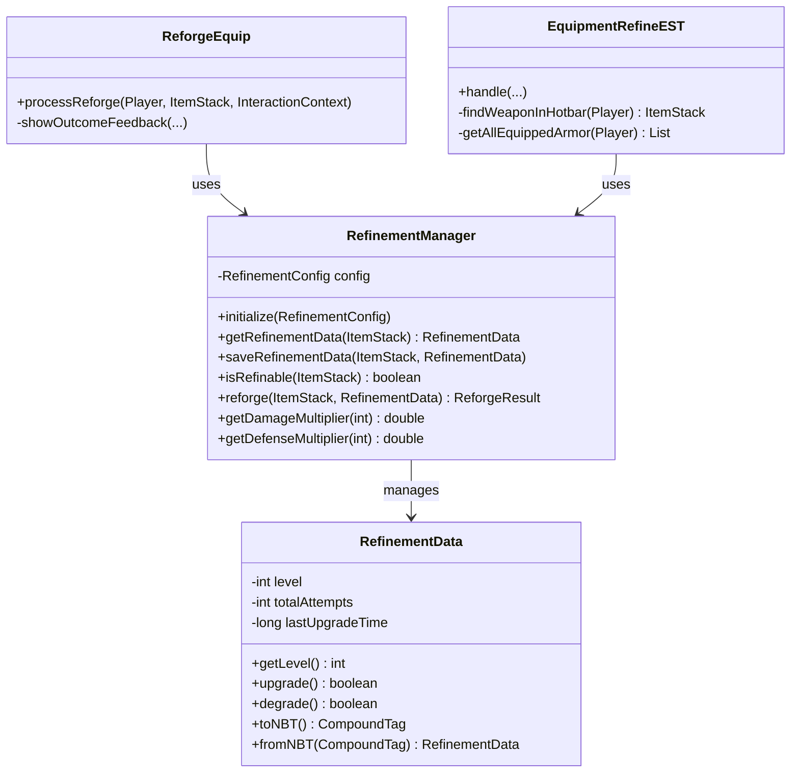

# Refinement System Overhaul: Metadata-Based Approach

## Executive Summary

The current refinement system duplicates items by creating separate item definitions for each upgrade level (e.g., `Weapon_Axe_Cobalt`, `Weapon_Axe_Cobalt1`, `Weapon_Axe_Cobalt2`, `Weapon_Axe_Cobalt3`). This requires the `/patchassets` command to generate these duplicate files.

This plan proposes overhauling the system to use item metadata/NBT instead, similar to how the Socket system works with `SocketData`.

---

## Current System Analysis

### How It Works Now

```mermaid
flowchart TD
    A[Player uses Reforge Bench] --> B[ReforgeEquip.processReforge]
    B --> C{Check item ID suffix}
    C --> D[Get current level from ID]
    D --> E[Roll upgrade outcome]
    E --> F[Create NEW ItemStack with new ID]
    F --> G[Replace old item with new item]
    
    H[/patchassets command] --> I[Scan Assets.zip]
    I --> J[Generate duplicate JSON files]
    J --> K[Create Weapon1/2/3 variants]
    K --> L[Update server.lang]
```

### Problems with Current Approach

1. **Item Duplication**: Each weapon/armor needs 4 separate JSON files
2. **Asset Patching Required**: Must run `/patchassets` to generate variants
3. **Maintenance Overhead**: Changes to base items require re-patching
4. **Storage Bloat**: Unnecessary duplication of item definitions
5. **Breaks Item Identity**: Item ID changes on upgrade

---

## Proposed Architecture

### Overview



### New Class: RefinementData

Similar to `SocketData`, stores refinement information in item metadata:

```java
package irai.mod.reforge.Refinement;

/**
 * Stored in item NBT under key "Refinement".
 * Tracks upgrade level for weapons and armor.
 */
public class RefinementData {
    
    private int level;           // 0-3 upgrade level
    private int totalAttempts;   // Optional: for statistics
    private long lastUpgradeTime; // Optional: timestamp
    
    // Constants
    public static final int MAX_LEVEL = 3;
    public static final String NBT_KEY = "Refinement";
    
    // Constructors
    public RefinementData() {
        this.level = 0;
    }
    
    public RefinementData(int level) {
        this.level = Math.max(0, Math.min(level, MAX_LEVEL));
    }
    
    // Getters
    public int getLevel() { return level; }
    public boolean isMaxLevel() { return level >= MAX_LEVEL; }
    public boolean isUpgradable() { return level < MAX_LEVEL; }
    
    // Mutations
    public boolean upgrade() {
        if (level >= MAX_LEVEL) return false;
        level++;
        return true;
    }
    
    public boolean degrade() {
        if (level <= 0) return false;
        level--;
        return true;
    }
    
    // Serialization for NBT
    public CompoundTag toNBT();
    public static RefinementData fromNBT(CompoundTag tag);
}
```

### New Class: RefinementManager

Similar to `SocketManager`, handles all refinement operations:

```java
package irai.mod.reforge.Refinement;

/**
 * Core logic for refinement operations.
 * Stateless - all item state lives in RefinementData.
 */
public class RefinementManager {
    
    public enum ReforgeResult { 
        SUCCESS,           // Upgrade succeeded
        FAIL,              // No change
        DEGRADE,           // Level decreased
        JACKPOT,           // +2 levels
        BREAK,             // Item destroyed
        MAX_LEVEL,         // Already max level
        NOT_REFINABLE      // Item cannot be refined
    }
    
    // Config reference
    private static RefinementConfig config;
    
    // ── Initialization ─────────────────────────────────────────────
    
    public static void initialize(RefinementConfig cfg);
    
    // ── Data Access ────────────────────────────────────────────────
    
    /**
     * Gets refinement data from item NBT.
     * Returns new RefinementData if none exists.
     */
    public static RefinementData getRefinementData(ItemStack item);
    
    /**
     * Saves refinement data to item NBT.
     */
    public static void saveRefinementData(ItemStack item, RefinementData data);
    
    /**
     * Checks if an item can be refined.
     */
    public static boolean isRefinable(ItemStack item);
    
    // ── Reforge Operations ──────────────────────────────────────────
    
    /**
     * Attempts to reforge an item.
     * @return The result of the reforge operation
     */
    public static ReforgeResult reforge(ItemStack item, RefinementData data);
    
    /**
     * Rolls for upgrade outcome based on current level.
     */
    public static ReforgeResult rollOutcome(int currentLevel);
    
    // ── Stat Calculations ───────────────────────────────────────────
    
    /**
     * Gets the damage multiplier for a weapon.
     */
    public static double getDamageMultiplier(int level);
    
    /**
     * Gets the defense multiplier for armor.
     */
    public static double getDefenseMultiplier(int level);
}
```

---

## File Changes

### Files to Create

| File | Purpose |
|------|---------|
| `src/main/java/irai/mod/reforge/Refinement/RefinementData.java` | Data class for refinement metadata |
| `src/main/java/irai/mod/reforge/Refinement/RefinementManager.java` | Core refinement logic |

### Files to Modify

| File | Changes |
|------|---------|
| `ReforgeEquip.java` | Use RefinementManager instead of ID-based system |
| `EquipmentRefineEST.java` | Read level from metadata instead of item ID |
| `ReforgePlugin.java` | Initialize RefinementManager, remove PatchAssetsCommand registration |
| `WeaponStatsUI.java` | Display refinement level from metadata |
| `WeaponStatsCommand.java` | Read level from metadata |

### Files to Remove

| File | Reason |
|------|--------|
| `Commands/PatchAssetsCommand.java` | No longer needed - no item duplication |

---

## Detailed Implementation Plan

### Phase 1: Create Core Classes

1. **Create `RefinementData.java`**
   - Define data structure for storing refinement level
   - Implement NBT serialization methods
   - Add helper methods for level checks

2. **Create `RefinementManager.java`**
   - Implement metadata read/write methods
   - Move reforge logic from ReforgeEquip
   - Implement stat calculation methods

### Phase 2: Update ReforgeEquip

1. **Remove ID-based logic**
   - Remove `getLevelFromItemId()` usage
   - Remove `getBaseItemId()` usage
   - Remove `createUpgradedItem()` method

2. **Add metadata-based logic**
   - Use `RefinementManager.getRefinementData()`
   - Use `RefinementManager.reforge()`
   - Update same item instead of creating new one

3. **Update UI methods**
   - Modify `showDetailedStats()` to use metadata
   - Modify `showCompactTooltip()` to use metadata

### Phase 3: Update EquipmentRefineEST

1. **Change level detection**
   - Replace `ReforgeEquip.getLevelFromItemId(weaponId)`
   - With `RefinementManager.getRefinementData(weapon).getLevel()`

2. **Update armor handling**
   - Same change for armor pieces

### Phase 4: Remove PatchAssetsCommand

1. **Remove command registration**
   - Remove from `ReforgePlugin.java`

2. **Delete command file**
   - Delete `Commands/PatchAssetsCommand.java`

3. **Clean up related files**
   - Remove any patchassets-specific config

### Phase 5: Update UI and Commands

1. **Update WeaponStatsUI**
   - Read refinement level from metadata

2. **Update WeaponStatsCommand**
   - Read refinement level from metadata

---

## Migration Considerations

### Existing Items

Items created with the old system will have IDs like `Weapon_Axe_Cobalt2`. A migration strategy is needed:

**Option A: Clean Break**
- Old items lose their refinement level
- Players must re-refine their equipment

**Option B: Migration Command**
- Create `/migraterefinement` command
- Reads level from old ID suffix
- Saves to metadata
- Updates item ID to base form

**Option C: Hybrid Detection**
- Check both metadata and ID suffix
- If no metadata but has suffix, use suffix level
- Gradually migrate items as they are used

**Recommended: Option C** - Provides backward compatibility without requiring manual migration.

---

## Benefits of New Approach

1. **No Item Duplication**: Single item definition per weapon/armor
2. **No Patching Required**: No need for `/patchassets` command
3. **Cleaner Code**: Separation of concerns with dedicated classes
4. **Easier Maintenance**: Changes to base items don't require re-patching
5. **Preserves Item Identity**: Item ID stays constant through upgrades
6. **Extensible**: Easy to add more refinement-related data later

---

## Architecture Diagram



---

## Implementation Checklist

- [ ] Create `Refinement/RefinementData.java`
- [ ] Create `Refinement/RefinementManager.java`
- [ ] Update `ReforgeEquip.java` to use metadata
- [ ] Update `EquipmentRefineEST.java` to use metadata
- [ ] Update `WeaponStatsUI.java` to use metadata
- [ ] Update `WeaponStatsCommand.java` to use metadata
- [ ] Remove `PatchAssetsCommand.java`
- [ ] Remove command registration from `ReforgePlugin.java`
- [ ] Add backward compatibility for old item IDs
- [ ] Test refinement flow end-to-end
- [ ] Test damage calculations with refined weapons
- [ ] Test defense calculations with refined armor
