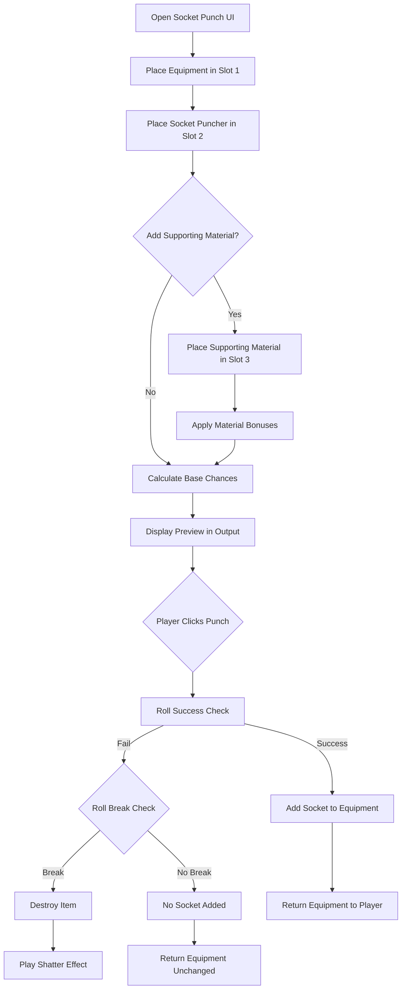
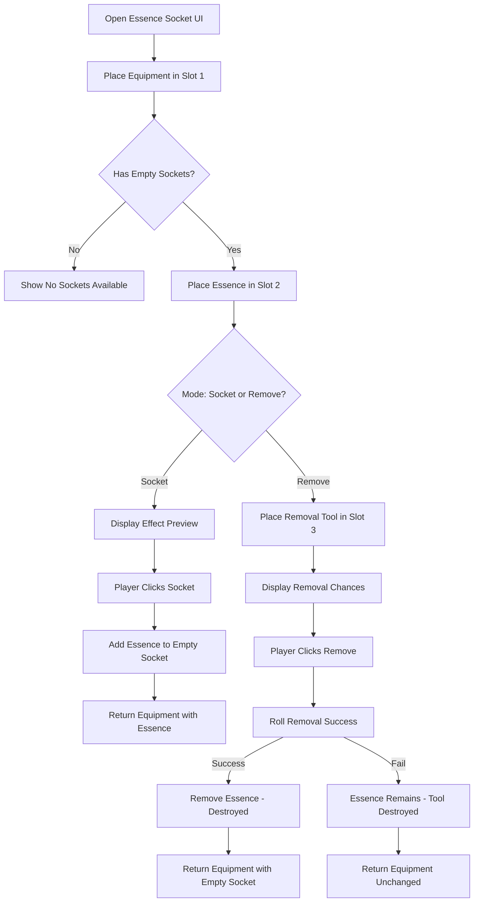
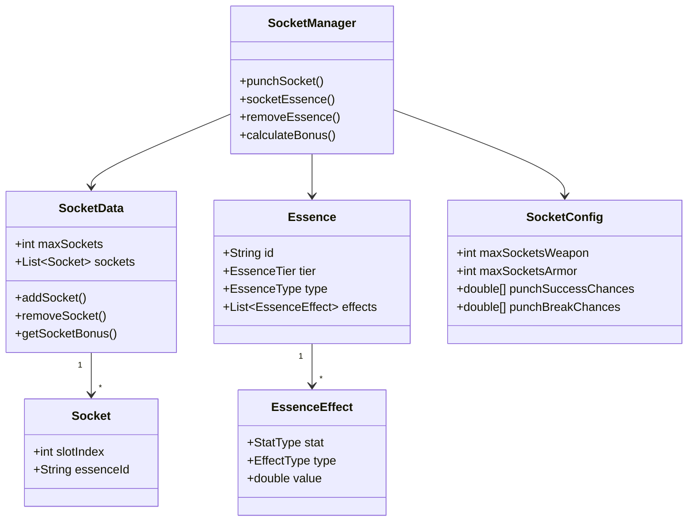

# Socket Punching System Architecture Plan

## Overview

This document outlines the architecture for implementing a socket punching system inspired by Path of Exile. The system allows players to punch sockets into equipment and fill them with essences that provide various stat bonuses.

## System Components

### 1. Core Data Structures

#### 1.1 Socket Data Model

```java
// Stored in item metadata NBT
public class SocketData {
    private int maxSockets;           // Maximum sockets this item can have
    private List<Socket> sockets;     // Currently filled sockets
    
    public static class Socket {
        private String essenceId;     // ID of socketed essence (null if empty)
        private int slotIndex;        // Position in socket list
    }
}
```

#### 1.2 Essence Definition

```java
public class Essence {
    private String id;                    // e.g., "Essence_Fire_1"
    private EssenceTier tier;             // 1-5 (higher = stronger effects)
    private EssenceType type;             // Fire, Ice, Lightning, Life, Shadow
    private List<EssenceEffect> effects;  // Stat modifications
}

public class EssenceEffect {
    private StatType stat;      // ATTACK_SPEED, LIFE_STEAL, CRIT_CHANCE, etc.
    private EffectType type;    // FLAT or PERCENTAGE
    private double value;       // The bonus value
}

public enum StatType {
    // Offensive
    ATTACK_SPEED, DAMAGE, CRIT_CHANCE, CRIT_DAMAGE,
    // Defensive  
    HEALTH, DEFENSE, EVASION,
    // Utility
    LIFE_STEAL, MOVEMENT_SPEED, LUCK
}

public enum EffectType {
    FLAT,       // +10 Attack Speed
    PERCENTAGE  // +5% Attack Speed
}
```

### 2. Essence Types and Effects

Based on Path of Exile-inspired balance:

| Essence Type | Tier 1 Effects | Tier 3 Effects | Tier 5 Effects |
|--------------|----------------|----------------|----------------|
| **Fire** | +2% Damage, +3 Flat DMG | +6% Damage, +8 Flat DMG | +12% Damage, +15 Flat DMG |
| **Ice** | +2% Slow, +2 Cold DMG | +5% Slow, +6 Cold DMG | +10% Slow, +12 Cold DMG |
| **Lightning** | +3% ATK Speed, +2% Crit | +7% ATK Speed, +4% Crit | +15% ATK Speed, +8% Crit |
| **Life** | +2% Lifesteal, +10 HP | +5% Lifesteal, +25 HP | +10% Lifesteal, +50 HP |
| **Shadow** | +5% Crit DMG, +2% Evasion | +12% Crit DMG, +5% Evasion | +25% Crit DMG, +10% Evasion |

### 3. Socket Configuration System

#### 3.1 SocketConfig.java

```java
public class SocketConfig {
    // Maximum sockets by equipment type
    private int maxSocketsWeapon = 4;
    private int maxSocketsArmor = 2;
    
    // Socket punching chances
    private double[] punchSuccessChances = {0.90, 0.75, 0.55, 0.35};  // Per socket count
    private double[] punchBreakChances = {0.02, 0.05, 0.10, 0.18};    // Item destruction
    
    // Essence removal
    private double essenceRemovalSuccessChance = 0.70;  // 70% success
    private double essenceRemovalDestroyChance = 0.30;  // 30% essence destroyed
}
```

### 4. Supporting Material System

Supporting materials provide various bonuses during socket punching:

| Material ID | Effect | Bonus |
|-------------|--------|-------|
| `Socket_Stabilizer` | Reduces break chance | -50% break chance |
| `Socket_Reinforcer` | Increases success rate | +20% success chance |
| `Socket_Guarantor` | Guarantees 1 socket | 100% for first socket |
| `Socket_Expander` | Chance for bonus socket | 25% chance for +1 socket |

### 5. UI Design

#### 5.1 Socket Punching UI (4 Slots)

```
┌─────────────────────────────────────────────────────────────┐
│                    SOCKET PUNCHING                          │
├─────────────────────────────────────────────────────────────┤
│  ┌─────────────┐  ┌─────────────┐  ┌─────────────┐         │
│  │  EQUIPMENT  │  │   MAIN      │  │ SUPPORTING  │         │
│  │   [SLOT]    │  │  MATERIAL   │  │  MATERIAL   │         │
│  │             │  │   [SLOT]    │  │   [SLOT]    │         │
│  │  Weapon/    │  │  Socket     │  │  Optional   │         │
│  │  Armor      │  │  Puncher    │  │  Booster    │         │
│  └─────────────┘  └─────────────┘  └─────────────┘         │
│                                                             │
│  ┌───────────────────────────────────────────────────────┐ │
│  │                      OUTPUT                           │ │
│  │  ┌───┐ ┌───┐ ┌───┐ ┌───┐                            │ │
│  │  │ ○ │ │ ○ │ │ ○ │ │ ○ │  Socket Preview            │ │
│  │  └───┘ └───┘ └───┘ └───┘                            │ │
│  │                                                       │ │
│  │  Success: 75%  |  Break: 5%  |  Sockets: 2/4        │ │
│  └───────────────────────────────────────────────────────┘ │
│                                                             │
│              [ PUNCH SOCKET ]                               │
└─────────────────────────────────────────────────────────────┘
```

#### 5.2 Essence Socketing UI (4 Slots)

```
┌─────────────────────────────────────────────────────────────┐
│                    ESSENCE SOCKETING                        │
├─────────────────────────────────────────────────────────────┤
│  ┌─────────────┐  ┌─────────────┐  ┌─────────────┐         │
│  │  EQUIPMENT  │  │   ESSENCE   │  │  CATALYST   │         │
│  │   [SLOT]    │  │   [SLOT]    │  │   [SLOT]    │         │
│  │             │  │             │  │  Optional   │         │
│  │  Sockets:   │  │  Fire, Ice, │  │  Removal    │         │
│  │  [●][○][○]  │  │  Lightning  │  │  Tool       │         │
│  └─────────────┘  └─────────────┘  └─────────────┘         │
│                                                             │
│  ┌───────────────────────────────────────────────────────┐ │
│  │                      OUTPUT                           │ │
│  │  ┌───┐ ┌───┐ ┌───┐ ┌───┐                            │ │
│  │  │ ● │ │ ○ │ │ ○ │ │ ○ │  Current Sockets           │ │
│  │  │Fir│ │   │ │   │ │   │                            │ │
│  │  └───┘ └───┘ └───┘ └───┘                            │ │
│  │                                                       │ │
│  │  Effect Preview:                                      │ │
│  │  • +6% Damage (Fire Essence)                         │ │
│  │  • +8 Flat Damage (Fire Essence)                     │ │
│  └───────────────────────────────────────────────────────┘ │
│                                                             │
│        [ SOCKET ESSENCE ]  or  [ REMOVE ESSENCE ]          │
└─────────────────────────────────────────────────────────────┘
```

### 6. Item Metadata Structure

Using builtin metadata system, socket data will be stored in item NBT:

```json
{
  "ItemId": "Weapon_Axe_Cobalt",
  "Quantity": 1,
  "Metadata": {
    "Sockets": {
      "MaxSockets": 4,
      "Sockets": [
        {
          "Index": 0,
          "EssenceId": "Essence_Fire_3"
        },
        {
          "Index": 1,
          "EssenceId": null
        }
      ]
    }
  }
}
```

### 7. Command Structure

```
/socketpunch - Opens the socket punching UI
/essencesocket - Opens the essence socketing UI
/socketinfo - Shows socket information for held item
```

### 8. Event System Integration

The socket system integrates with the existing `EquipmentRefineEST` damage system:

```java
// In EquipmentRefineEST.handle()
// After calculating base damage from refinement level
double socketBonus = calculateSocketBonus(weapon);
damage.setAmount(damage.getAmount() * socketBonus);
```

### 9. File Structure

```
src/main/java/irai/mod/reforge/
├── Socket/
│   ├── SocketData.java           # Socket data model
│   ├── SocketManager.java        # Socket operations
│   ├── Essence.java              # Essence definition
│   ├── EssenceRegistry.java      # Essence type registry
│   ├── EssenceEffect.java        # Effect model
│   └── SocketConfig.java         # Configuration
├── Config/
│   └── SocketConfig.java         # Socket configuration (already exists)
├── UI/
│   ├── SocketPunchUI.java        # Socket punching UI
│   └── EssenceSocketUI.java      # Essence socketing UI
├── Commands/
│   ├── SocketPunchCommand.java   # Command to open punch UI
│   └── EssenceSocketCommand.java # Command to open socket UI
├── Interactions/
│   ├── SocketPunchInteraction.java
│   └── EssenceSocketInteraction.java
└── Entity/Events/
    └── SocketEffectEST.java      # Applies socket effects to damage

src/main/resources/
├── Server/Item/Items/
│   ├── Socket/
│   │   ├── Socket_Puncher.json       # Main material
│   │   ├── Socket_Stabilizer.json    # Supporting material
│   │   ├── Socket_Reinforcer.json    # Supporting material
│   │   ├── Socket_Guarantor.json     # Supporting material
│   │   └── Socket_Expander.json      # Supporting material
│   └── Essence/
│       ├── Essence_Fire_1.json       # Tier 1-5 for each type
│       ├── Essence_Fire_2.json
│       ├── ...
│       └── Essence_Shadow_5.json
├── Common/UI/Custom/
│   ├── SocketPunchUI.ui
│   └── EssenceSocketUI.ui
└── Server/Config/
    └── SocketConfig.json             # Socket configuration file
```

### 10. Implementation Phases

#### Phase 1: Core Data Structures
- Create `SocketData`, `Socket`, `Essence`, `EssenceEffect` classes
- Create `SocketConfig` configuration class
- Create `SocketManager` for socket operations

#### Phase 2: Essence System
- Create `EssenceRegistry` for essence definitions
- Create essence item JSON files
- Create essence recipes

#### Phase 3: Socket Punching
- Create `SocketPunchInteraction` class
- Create `SocketPunchUI` and UI definition
- Create `SocketPunchCommand`
- Create socket puncher item

#### Phase 4: Essence Socketing
- Create `EssenceSocketInteraction` class
- Create `EssenceSocketUI` and UI definition
- Create `EssenceSocketCommand`
- Create socket removal tool

#### Phase 5: Effect Application
- Create `SocketEffectEST` for damage/stat modifications
- Integrate with existing `EquipmentRefineEST`
- Add socket stat display to tooltips

#### Phase 6: Supporting Materials
- Create supporting material item definitions
- Implement material effects in socket operations

### 11. Balance Considerations

Based on Path of Exile balance philosophy:

1. **Diminishing Returns**: Each additional socket is harder to obtain
2. **Risk/Reward**: Higher socket counts have higher break chances
3. **Essence Tiers**: Higher tier essences are rarer but more powerful
4. **Socket Limits**: Weapons get more sockets than armor for balance
5. **Removal Cost**: Removing essences destroys them (risk vs keeping item)

### 12. Mermaid Diagrams

#### Socket Punching Flow



#### Essence Socketing Flow



#### System Architecture



---

## Next Steps

1. Review and approve this architecture plan
2. Switch to Code mode to begin implementation
3. Start with Phase 1: Core Data Structures
